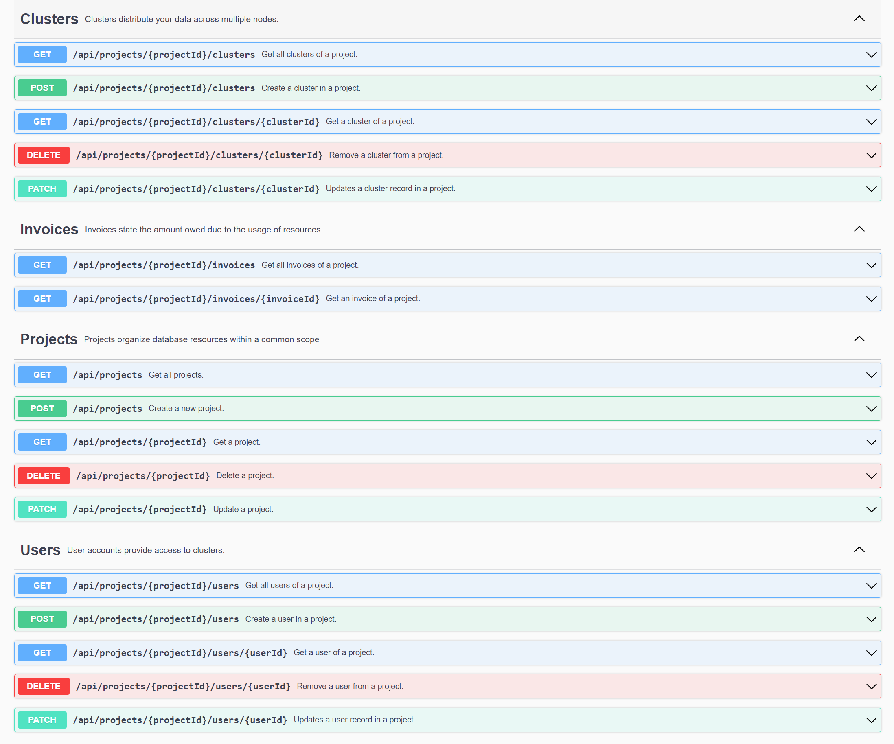

# MyCloud

Just a small project to explore REST API creation in ASP.NET.

## Features

- Pagination
- Compression
- Content Negotiation
- API Versioning
- Authorization
- Updates via [JsonPatch](https://www.google.com/search?q=jsonpatch+rfc&oq=jsonpatch+rfc&aqs=edge.0.0i512j0i22i30.1625j0j4&sourceid=chrome&ie=UTF-8) documents

## Endpoints

